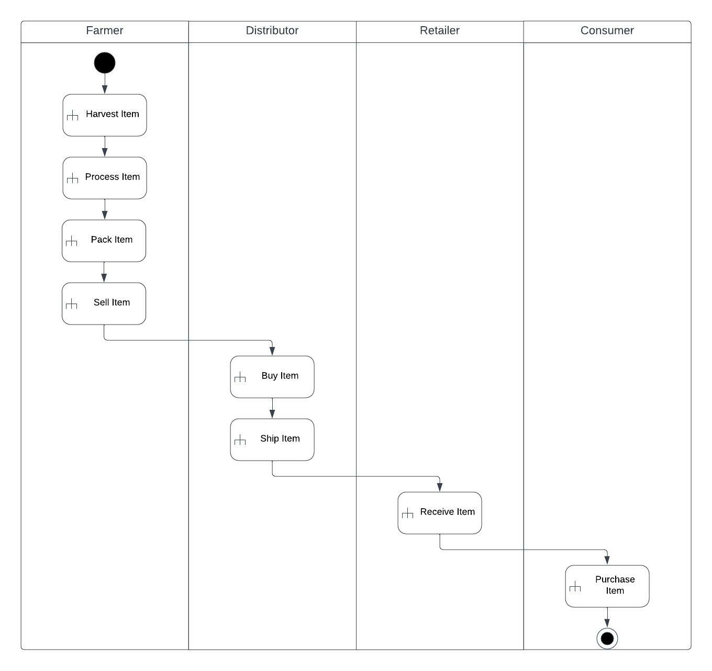
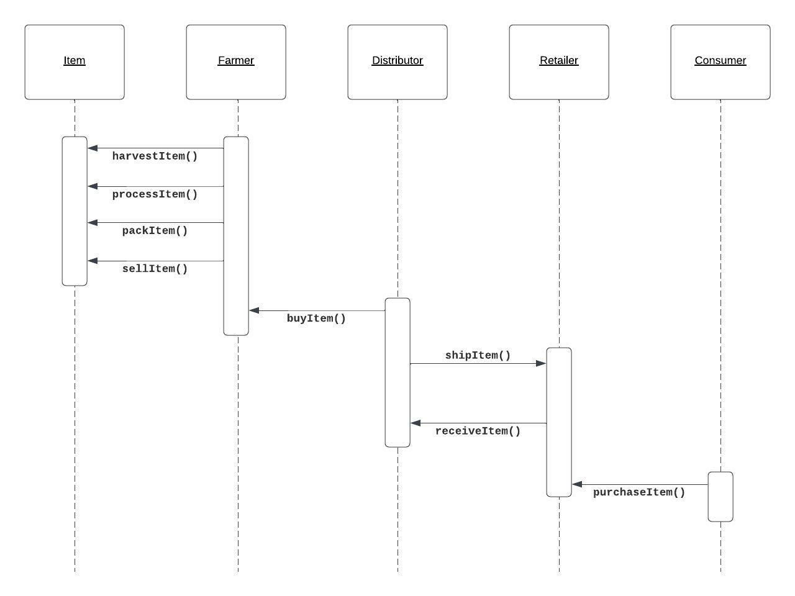
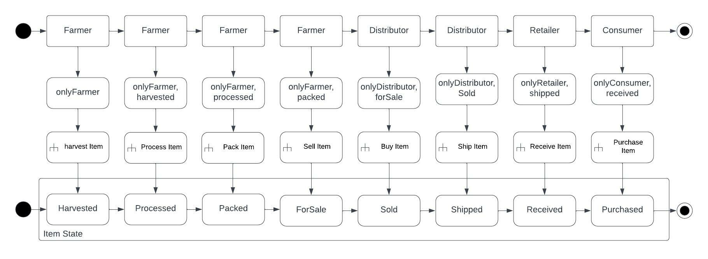
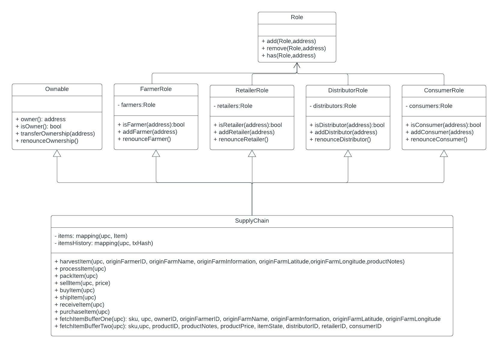

# Supply chain on Ethereum

## Project Write-Up

### UML Design

#### Activity Diagram
<br>
#### Sequence Diagram
<br>
#### State Diagram
<br>
#### Class Diagram
<br>

### Program versions / Libraries
* Truffle v5.4.33 (core: 5.4.33)
* Ganache v7.0.1
* Solidity - ^0.8.0 (solc-js)
* Node v16.13.1
* Web3.js v1.5.3
* IPFS - not used

## Smart Contract Deployed on rinkeby
   transaction hash:    [0xd6d51d2a0664dbee76b9e7c12fb9c1b434985e101b68c88d69c2962cec09a1df](https://rinkeby.etherscan.io/tx/0xd6d51d2a0664dbee76b9e7c12fb9c1b434985e101b68c88d69c2962cec09a1df)<br/>
   contract address:    [0x572ed980caAdD71dde9A7cB7cAeE22Ea9E4A5dc6](https://rinkeby.etherscan.io/address/0x572ed980caadd71dde9a7cb7caee22ea9e4a5dc6)<br/>

## Installation

Make `.secret` and append secret key(words phrase) into it.

## Deployment

```shell
> truffle develop

> truffle compile && truffle test && truffle migrate --network rinkeby
```


## Project Introduction
This repository containts an Ethereum DApp that demonstrates a Supply Chain flow between a Seller and Buyer. The user story is similar to any commonly used supply chain process. A Seller can add items to the inventory system stored in the blockchain. A Buyer can purchase such items from the inventory system. Additionally a Seller can mark an item as Shipped, and similarly a Buyer can mark an item as Received.

The DApp User Interface when running should look like...


## Built With
* [Ethereum](https://www.ethereum.org/) - Ethereum is a decentralized platform that runs smart contracts
* [IPFS](https://ipfs.io/) - IPFS is the Distributed Web | A peer-to-peer hypermedia protocol
to make the web faster, safer, and more open.
* [Truffle Framework](http://truffleframework.com/) - Truffle is the most popular development framework for Ethereum with a mission to make your life a whole lot easier.
